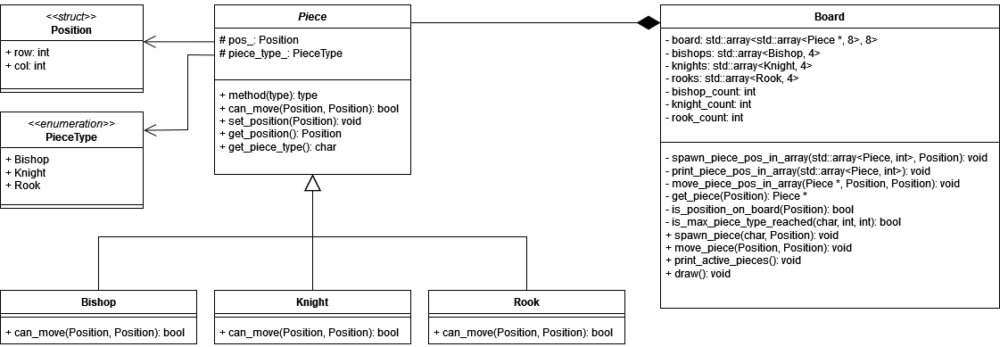

This repository contains the implementation of a programming task designed to test my understanding of Object-Oriented Programming concepts in C++ through a chess demonstrator.

The program allows a single player to place and move chess pieces on a board, adhering to the standard movement rules of chess. For this demonstration, only a subset of pieces has been implemented. Additionally, no colors have been assigned to the pieces, so capturing is not part of the gameplay. The entire program is designed to operate exclusively on the stack.

Below is the UML class diagram representing the current implementation.

